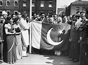
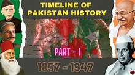
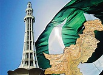
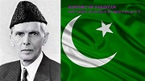

<html lang="en">
<head>
    <meta charset="UTF-8">
    <meta http-equiv="X-UA-Compatible" content="IE=edge">
    <meta name="viewport" content="width=device-width, initial-scale=1.0">
    <title>mineblock.crowd</title>
</head>

<body>
    <h1 id="h1">hello world</h1>
    
Wellcome to my mineblock.corwd website 

    
...we provide information or more things:like=links,news,etc...

    <h1 id="h1">story of 3-cows and 1-lion</h1>
    
Once, three cows lived in a green and fresh pasture near a forest: a white cow, a black cow and a reddish-brown cow. The cows were kind to each other. They used to graze in the meadow together and sleep near each other.

        One day, a reddish-brown lion happened to take a stroll out of the forest onto the meadow. It was hungry and looking for a prey. On catching sight of the cows it became glad, but couldn't attack them, because they were together. So, the lion sat behind a boulder and patiently waited till the cows would separate from each other.
        
        However, the cows were too clever to separate from each other. They knew that if they were together, no predator could attack them. The lion lay in ambush nearby for two or three days. But the cows continued to remain together, and wouldn’t separate from each other. The lion became impatient. It thought of a plan. It went towards the cows, greeted them and said, “How are you my friends? Are you fine? I have been busy lately, so could not come and visit you. Today I made up my mind to pay you a visit.”
        
        The reddish-brown cow said, “Sir, your coming has really pleased us and brightened our pasture.”
        
        Both the white and the black cows were troubled by what their friend, the reddish-brown cow said, and were grieved at its thoughtlessness. They said to each other, “Why does the reddish-brown cow believe what the lion says?
        
        Doesn’t it know that lions seek other animals only to prey on them?”
        
        As the days passed by, the reddish-brown cow became more and more attached to the lion. The black cow and the white cow advised it against a friendship with the lion, but their efforts were in vain.One day, the lion said to the reddish-brown cow, “You know that the color of our bodies is dark and that the color of the body of the white cow is light. You also know that light color is the opposite of the dark color. It will be very good if I eat the white cow, so that there will be no difference among us any longer and we will be able to live together well.”The reddish-brown cow accepted the lion’s argument and started talking to the black cow to keep it busy, so that the lion could eat the white cow. The white cow was left alone and was killed, while the black and the reddish-brown cows were busy in idle talk.

        Two or three days passed since the lion devoured the white cow. It became hungry again. It called the reddish-brown cow. The cow answered: “Yes sir!”
        
        The lion said, “The color of my body and the color of your body are both reddish-brown, and black does not go with our color. It will be very good if I eat the black cow, so that in this forest we all will be of the same color.” The reddish-brown cow accepted this argument and moved away from the black cow.
        
        The lion attacked and devoured the black cow soon. And as for the reddish-brown cow, it was so filled with joy that it didn’t know what to do. It roamed and grazed and said to itself, “It is only me who has the color of the lion.”
        
        A few days passed later, the lion was hungry again. It roared and said, “O the reddish-brown cow! Where are you?” The reddish-brown cow, shaking with fear, went forward and said, “Yes sir!”

The lion said: “Today it is your turn. Get yourself ready, I am going to eat you.”

The reddish-brown cow, with great fear and horror, said, “Why sir, I am your friend. I did whatever you asked me to do. Still why do you want to eat me?”

The lion roared and said, “I have no friends. How is it possible that a lion makes friendship with a cow?”

No matter how much the reddish-brown cow begged and entreated, the lion didn’t accept its words. Finally the cow said, “Mr. Lion, please allow me to cry out three times before you eat me.”

The lion said, “Ok. Quickly, quickly!”

The reddish-brown cow cried out, “I was eaten the very day the white cow was eaten. I was eaten the very day the black cow was eaten. I was eaten the very day I made friends with the lion.”

The lion devoured the reddish-brown cow very quickly. Then it said to itself: “I have finished my job in this forest. Now I had better go to other forests.”

Any group without unity will easily be destroyed.

<h1 id="h1"> live earth in space look like </h1>

 
  
                 
Pakistan has a (somewhat fragile) parliamentary democracy. The President is the Head of State, while the Prime Minister is the Head of Government. Prime Minister Mian Nawaz Sharif and President Mamnoon Hussain were elected in 2013. Elections are held every five years and incumbents are eligible for reelection.

             <h1 ID="h1">what is Geography? of pakistan... </h1>
           
Pakistan's two-house Parliament (Majlis-e-Shura) is made up of a 100-member Senate and a 342-member National Assembly
    The judicial system is a mix of secular and Islamic courts, including a Supreme Court, provincial courts, and Federal Shari'a courts that administer Islamic law. Pakistan's secular laws are based on British common law. All citizens over 18 years of age have the vote. 

                                                                                  <h1 ID="h1">Population of Pakistan </h1>
                     
Pakistan's population estimate as of 2015 was 199,085,847, making it the sixth most populous nation on Earth.
                                 The largest ethnic group is the Punjabi, with 45 percent of the total population. Other groups include the Pashtun (or Pathan), 15.4 percent; Sindhi, 14.1 percent; Sariaki, 8.4 percent; Urdu, 7.6 percent; Balochi, 3.6 percent; and smaller groups making up the remaining 4.7 percent.
                            The birth rate in Pakistan is relatively high, at 2.7 live births per woman, so the population is expanding rapidly. The literacy rate for adult women is only 46 percent, compared with 70 percent for men.
    

                 <h1 ID="h1">language of pakistan? </h1>
                           
The official language of Pakistan is English, but the national language is Urdu (which is closely related to Hindi). Interestingly, Urdu is not spoken as a native language by any of Pakistan's main ethnic groups and was chosen as a neutral option for communication among the various peoples of Pakistan.
        Punjabi is the native tongue of 48 percent of Pakistanis, with Sindhi at 12 percent, Siraiki at 10 percent, Pashtu at 8 percent, Balochi at 3 percent, and a handful of smaller language groups. Most Pakistan languages belong to the Indo-Aryan language family and are written in a Perso-Arabic script.
    

    <h1 ID="h1">history of pakistan ? </h1>
    
The nation of Pakistan is a modern creation, but people have been building great cities in the area for some 5,000 years. Five millennia ago, the Indus Valley Civilization created great urban centers at Harappa and Mohenjo-Daro, both of which are now in Pakistan.

        The Indus Valley people mixed with Aryans moving in from the north during the second millennium B.C. Combined, these peoples are called the Vedic Culture; they created the epic stories upon which Hinduism is founded.
        
             The lowlands of Pakistan were conquered by Darius the Great around 500 B.C. His Achaemenid Empire ruled the area for nearly 200 years.
        
                   Alexander the Great destroyed the Achaemenids in 334 B.C., establishing Greek rule as far as the Punjab. After Alexander's death 12 years later, the empire was thrown into confusion as his generals divided up the satrapies; a local leader, Chandragupta Maurya, seized the opportunity to return the Punjab to local rule. Nonetheless, Greek and Persian culture continued to exert a strong influence on what is now Pakistan and Afghanistan.
                     
                          The Mauryan Empire later conquered most of South Asia; Chandragupta's grandson, Ashoka the Great, converted to Buddhism in the third century B.C.
                                     
                           Another important religious development occurred in the 8th century A.D. when Muslim traders brought their new religion to the Sindh region. Islam became the state religion under the Ghaznavid Dynasty (997-1187 A.D.).
                             
                             A succession of Turkic/Afghan dynasties ruled the region through 1526 when the area was conquered by Babur, founder of the Mughal Empire. Babur was a descendant of Timur (Tamerlane), and his dynasty ruled most of South Asia until 1857 ​when the British took control. After the so-called Sepoy Rebellion of 1857, the last Mughal Emperor, Bahadur Shah II, was exiled to Burma by the British.
        
                                 Great Britain had been asserting ever-increasing control through the British East India Company since at least 1757. The British Raj, the time when South Asia fell under direct control by the UK government, lasted until 1947.
        
                             Muslims in the north of British India, represented by the Muslim League and its leader, Muhammad Ali Jinnah, objected to joining the independent nation of India after World War II. As a result, the parties agreed to a Partition of India. Hindus and Sikhs would live in India proper, while Muslims got the new nation of Pakistan. Jinnah became the first leader of independent Pakistan.
                    
                            Originally, Pakistan consisted of two separate pieces; the eastern section later became the nation of Bangladesh.
        
                     Pakistan developed nuclear weapons in the 1980s, confirmed by nuclear tests in 1998. Pakistan has been an ally of the United States in the war on terror. They opposed the Soviets during the Soviet-Afghan war but relations have improved.
        

 
 
        <h1 ID="h1">Religion in Pakistan</h1>
        
An estimated 95-97 percent of Pakistanis are Muslim, with the remaining few percentage points made up of small groups of Hindus, Christians, Sikhs, Parsi (Zoroastrians), Buddhists and followers of other faiths.

            About 85-90 percent of the Muslim population are Sunni Muslims, while 10-15 percent are Shi'a.
            
            Most Pakistani Sunnis belong to the Hanafi branch, or to the Ahle Hadith. Shi'a sects represented include the Ithna Asharia, the Bohra, and the Ismailis.

 
 
<h1 ID="h1">here is some pakistan history pictures</h1>
             
             
             
             

<h1 ID="h1">website creater : MUHAMMAD GOHAR </h1>
</body>
</html> 
